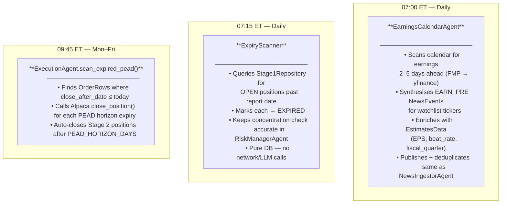

# Agent Chain Diagram

## Main Pipeline (LangGraph — per polling cycle)

```mermaid
flowchart TD
    START([Polling cycle starts]) --> NEWS

    NEWS["**NewsIngestorAgent**
    ─────────────────────
    • Fetches articles via NewsProvider
      (RSS or Benzinga)
    • Filters to watchlist tickers
    • Deduplicates by event_id (SQLite)
    • Classifies headline → EventType
      (EARNINGS, FDA_APPROVAL, M&A, …)
    • Publishes NewsEvents to Redis bus
    ─────────────────────
    Out → news_events[]"]

    NEWS -- "no new events" --> END1([END])
    NEWS -- "has events" --> MARKET

    MARKET["**MarketDataAgent**
    ─────────────────────
    • Extracts unique tickers from events
    • Fetches OHLCV bars + volatility
      via MarketDataProvider
      (yfinance / Massive)
    • Graceful degradation on failure
    ─────────────────────
    Out → market_context{ticker→MarketSnapshot}"]

    MARKET --> SENTIMENT

    SENTIMENT["**SentimentAnalystAgent**
    ─────────────────────
    • Optional keyword pre-filter
      (skips Claude when no fin. terms)
    • Delegates batch scoring to
      SentimentProvider (Claude or Keyword)
    • LLM tier routing:
      – quick (Haiku) → generic events
      – deep (Sonnet) → EARN_* events
    • Falls back to neutral on budget cap
    ─────────────────────
    Out → sentiment_results[]"]

    SENTIMENT --> SIGNAL

    SIGNAL["**SignalGeneratorAgent**
    ─────────────────────
    • Pairs sentiment + market snapshot
    • ConfidenceScorer: 4-component
      weighted scoring + gate check
    • EARN_* two-stage logic (Pattern D):
      – EARN_PRE → size by beat_rate,
        persist Stage1 position
      – EARN_BEAT/MISS → confirm/reverse
        Stage 1 position
      – EARN_MIXED → CLOSE signal
        (bypasses confidence gate)
    • Optional bull/bear debate
      (Pattern A — LLM rounds):
      – CONFIRM / REDUCE / REJECT
    ─────────────────────
    Out → trade_signals[]"]

    SIGNAL --> RISK

    RISK["**RiskManagerAgent**
    ─────────────────────
    Five fail-fast checks:
    1. Confidence gate
    2. Drawdown halt → system_halted
    3. Concentration limit
       (Stage 2 ADD exempt)
    4. Pending ticker dedup
    5. Direction conflict
    + Soft size cap (L3b)
    Supports risk_dry_run mode
    ─────────────────────
    Out → approved_signals[]
           rejected_signals[]
           system_halted bool"]

    RISK -- "system_halted = true" --> HALT
    RISK -- "approved signals exist" --> EXEC
    RISK -- "all rejected" --> END2([END])

    HALT["**HaltHandlerAgent**
    ─────────────────────
    Emergency drawdown cleanup:
    • Cancels all pending Alpaca orders
    • Closes all open Alpaca positions
    • Marks all OPEN Stage 1 positions
      → EXPIRED in SQLite
    Errors logged but never block
    subsequent steps
    ─────────────────────
    (no state output)"]

    HALT --> END3([END])

    EXEC["**ExecutionAgent**
    ─────────────────────
    • Translates signals → Alpaca
      market orders (BUY/SELL)
    • Persists OrderRow to SQLite
      with close_after_date
      (computed from horizon_days)
    • Publishes order events to Redis
    ─────────────────────
    Out → orders[]"]

    EXEC --> END4([END])
```

---

## Cron Agents (APScheduler — independent of polling cycle)

---

## Shared State (`PipelineState` TypedDict)

| Field | Type | Set by |
|---|---|---|
| `news_events` | `list[NewsEvent]` | NewsIngestorAgent |
| `market_context` | `dict[str, MarketSnapshot]` | MarketDataAgent |
| `sentiment_results` | `list[SentimentResult]` | SentimentAnalystAgent |
| `trade_signals` | `list[TradeSignal]` | SignalGeneratorAgent |
| `approved_signals` | `list[TradeSignal]` | RiskManagerAgent |
| `rejected_signals` | `list[TradeSignal]` | RiskManagerAgent |
| `orders` | `list[Order]` | ExecutionAgent |
| `portfolio` | `Portfolio \| None` | RiskManagerAgent |
| `errors` | `list[str]` | any agent |
| `system_halted` | `bool` | RiskManagerAgent |

---

## Key Services (injected into agents)

| Service | Used by | Purpose |
|---|---|---|
| `LLMClientFactory` | SignalGeneratorAgent, SentimentAnalystAgent | Two-tier LLM routing: `.quick` (Haiku) / `.deep` (Sonnet) |
| `ConfidenceScorer` | SignalGeneratorAgent | 4-component weighted score + confidence gate per EventType |
| `EstimatesRenderer` | ConfidenceScorer, ClaudeSentimentProvider | Deterministic FMP data → narrative for LLM prompts |
| `Stage1Repository` | SignalGeneratorAgent, RiskManagerAgent, HaltHandlerAgent | EARN_PRE position CRUD + outcome reflection (Pattern D) |
| `EventBus` | all agents | Redis async pub/sub for inter-agent events |
